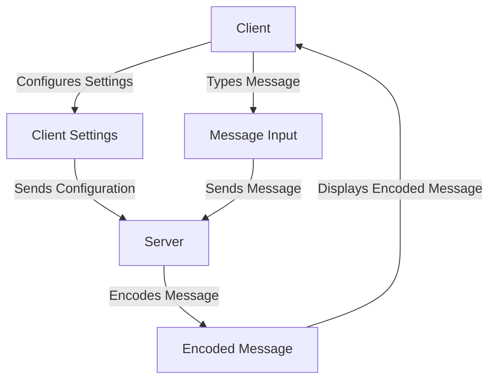

# **MsgCypher** :lock:

A simple message encoding app with the API for personal skill development. Following [freeCodeCamp's tutorial on Django](https://www.youtube.com/watch?v=UmljXZIypDc).

Awesome `mermaid` diagram making this look way fancier than it is:



This project is developed on Windows, and utilizes [`miniforge`](https://github.com/conda-forge/miniforge) ([`mamba`](https://mamba.readthedocs.io/en/latest/user_guide/mamba.html#mamba) included) to manage/install Python packages. If you know `conda`, mamba is literally the same (including the CLI), but much faster. In all commands related to virtual environments, mamba can be replaced with conda without any issues, so if you have conda, you don't need to install miniforge (though I recommend it).

> [!WARNING]
> The terminal used in this project is *PowerShell 7.3.9* (MS Store version, initialized with mamba) &ndash; if you are using another shell, some commands might not work. See [*Starting From Scratch*](#optional-creating-msgcypher-from-scratch) for more info.

## Table of Contents

- [**MsgCypher** :lock:](#msgcypher-lock)
  - [Table of Contents](#table-of-contents)
  - [**Executing the Repository Locally**](#executing-the-repository-locally)
    - [**1. Get Repo**](#1-get-repo)
    - [**2. Replicate Environment With mamba or conda**](#2-replicate-environment-with-mamba-or-conda)
    - [**3. Launch the local host (default port 8000)**](#3-launch-the-local-host-default-port-8000)
  - [**(OPTIONAL) Creating MsgCypher From Scratch**](#optional-creating-msgcypher-from-scratch)
    - [**1. Setup a Mamba Ambush**](#1-setup-a-mamba-ambush)
      - [***Install Miniforge On Windows***](#install-miniforge-on-windows)
      - [***Recommended: Initialize mamba for PowerShell***](#recommended-initialize-mamba-for-powershell)
    - [**2. Unchain Django**](#2-unchain-django)
    - [**3. Create Apps**](#3-create-apps)
      - [***Models for User Messages***](#models-for-user-messages)
      - [***Register Models for Admin Page***](#register-models-for-admin-page)
      - [***Forms for User Inputs***](#forms-for-user-inputs)
      - [***Encoding/Decoding Views***](#encodingdecoding-views)
      - [***URLs (URLConf) for Views***](#urls-urlconf-for-views)
      - [***Add Apps' URLConfs to Project URLConf***](#add-apps-urlconfs-to-project-urlconf)
    - [**4. Run Migrations**](#4-run-migrations)
    - [**5. Setup HTML Templates for Webpages**](#5-setup-html-templates-for-webpages)
    - [**6. Run the Server**](#6-run-the-server)
  - [**AWS EC2 Deployment :cloud: (Free-Tier)**](#aws-ec2-deployment-cloud-free-tier)
    - [**1. Creating a Windows-Based EC2 Instance**](#1-creating-a-windows-based-ec2-instance)
    - [**2. Connecting to the Windows EC2 Instance**](#2-connecting-to-the-windows-ec2-instance)
      - [***From Windows Machines***](#from-windows-machines)
        - [*Troubleshooting*](#troubleshooting)
      - [***From VSCode (remotely via the Key Pair File)***](#from-vscode-remotely-via-the-key-pair-file)
      - [***From Non-Windows Machines***](#from-non-windows-machines)
    - [**3. Deploying the App on the Windows EC2 Instance**](#3-deploying-the-app-on-the-windows-ec2-instance)
  - [**Docker Deployment**](#docker-deployment)
  - [**CI/CD Checklist With GitHub Actions (TODO)**](#cicd-checklist-with-github-actions-todo)
    - [**Tests**](#tests)
    - [**App-Related**](#app-related)

## **Executing the Repository Locally**

### **1. Get Repo**

Either:

- Clone this repo:

    ```shell
    # Clone to current directory
    git clone https://github.com/thkodin/MsgCypher.git {clone-path}
    ```

- Or, [download it as a zip](https://github.com/thkodin/MsgCypher/archive/refs/heads/main.zip) and extract the repository. You can also do this from PowerShell, which might be helpful if you are connecting remotely.

    ```shell
    Invoke-WebRequest https://github.com/thkodin/MsgCypher/archive/refs/heads/main.zip -OutFile {download-path}
    Expand-Archive {zip-path} -DestinationPath {extract-path}
    ```

Finally, `cd` into the repository root directory (i.e., where this README file and manage.py are located).

### **2. Replicate Environment With mamba or conda**

Assuming either mamba/conda installed and no environment active in current shell, simply use the `environment.yml` included in this repo to replicate the virtual environment by running:

```shell
# mamba can be replaced with conda
mamba env create -f environment.yml
```

Note that this creates the venv in your default configured directory for new named virtual environments. On a typical installation, this will be `C:\Users\<username>\miniforge3\envs\`.

If you want to install the venv to a custom path, use the `--prefix` (shorthand `-p`) flag:

```shell
# mamba can be replaced with conda
mamba env create -f environment.yml -p {path-to-install-venv}
```

Once installed, activate it:

```shell
mamba activate {path-to-installed-venv}
```

### **3. Launch the local host (default port 8000)**

```shell
python manage.py runserver
```

To launch on a different port, e.g., 9000:

```shell
python manage.py runserver 9000
```

The terminal will offer a link to the hosted server &ndash; follow it to enter the homepage. From there, do whatever you want to :smile:

## **(OPTIONAL) Creating MsgCypher From Scratch**

### **1. Setup a Mamba Ambush**

Information sourced from [mamba documentation](https://mamba.readthedocs.io/en/latest/user_guide/mamba.html#mamba) and their [installation guide](https://mamba.readthedocs.io/en/latest/mamba-installation.html).

All you need to do is head to the [Miniforge repository](https://github.com/conda-forge/miniforge) and download the installer specific to your platform. On the [release page](https://github.com/conda-forge/miniforge/releases/) as well as the repo's README, you'll find two miniforge versions (at the time of this writing):

- `miniforge3`: Comes with Python 3.10
- `miniforge-pypy3`: Comes with Python 3.9

The installed will guide you through the installation process. Otherwise, if you prefer terminal-based installation, their README will guide you through that process for various platforms.

#### ***Install Miniforge On Windows***

On Windows, I recommend just using the GUI of the downloaded installer with all the **recommended** options. However, based on your preference, do consider changing the following:

- installing miniforge ONLY for the current user
- registering/not registering miniforge's python as system default
- the option to `delete the cache after installation`, as that would save some space.

If you want to be all *PowerShell* about it, open either Windows PowerShell (`powershell`) or MS Store PowerShell (`pwsh`) as admin. Note that if the current shell is Command Prompt or unelevated PowerShell, you can launch PowerShell as admin (will have to enter password) with one of the following commands:

```shell
# Command Prompt
runas /user:Administrator pwsh  # MS Store PWSH
runas /user:Administrator powershell  # Windows PWSH
```

With the elevated PowerShell, run:

```shell
# Download the installer for Miniforge3 23.3.1
Invoke-WebRequest https://github.com/conda-forge/miniforge/releases/download/23.3.1-1/Miniforge3-Windows-x86_64.exe -OutFile Miniforge3-Windows-x86_64.exe

# Install non-interactively
start /wait "" Miniforge3-Windows-x86_64.exe /InstallationType=JustMe /RegisterPython=0 /S /D=%UserProfile%\miniforge3
```

Feel free to change `RegisterPython=1` if you want to use the miniforge python as the system default.

#### ***Recommended: Initialize mamba for PowerShell***

Initializing PowerShell with mamba requires opening the Miniforge Prompt (automatically installed if Start tools are kept checked during miniforge installation) and then running:

```shell
# Miniforge Prompt
mamba init powershell

# Launch powershell (replace with `pwsh` for store version)
powershell
```

If you do not have Miniforge Prompt for whatever reason, you can use PowerShell or CMD to initialize mamba for PowerShell like so:

```shell
# Command Prompt/PowerShell
{miniforge-path}\Scripts\activate.bat {miniforge-path}

# Deactivate base (auto-activates by default, skip if edited)
conda deactivate

# Initialize powershell profile for mamba
mamba init powershell

# Launch/Relaunch powershell (replace with `pwsh` for store version)
powershell
```

Based on the version of miniforge you installed, the default installation paths are:

- (miniforge3): `C:\Users\{username}>\miniforge3`
- (miniforge-pypy3): `C:\Users\{username}\miniforge-pypy3`

Now, you can access all conda/mamba commands directly from PowerShell.

> [!IMPORTANT]
> As of the time of this writing, the latest miniforge release [Miniforge3 23.3.1-1](https://github.com/conda-forge/miniforge/releases/tag/23.3.1-1) is ***NOT*** up-to-date with the latest mamba release. As such, to create a virtual environment and activate it within powershell, you still need to use `conda create` and `conda activate` to create and activate/deactivate environments as `mamba create` and `mamba activate` will not work (or appear to work, but have no effect). There is a workaround &ndash; I might create a repo explaining it and link it here later.

### **2. Unchain Django**

*I am having way too much fun with these section titles.*

Open up a project in any folder with VSCode, and fire up a PowerShell terminal in this directory (or use VSCode's integrated one if you have it configured to use PowerShell). Assuming a default mamba configuration with nothing changed, the following will create a virtual environment in the `miniforge` directory:

```shell
# Powershell 7.3.9 #
conda create msgcypher-venv python=3.11
```

Confirm all prompts, and when it's done, verify it's recognized by mamba. The following commands will print a list of recognized environments, activate it, and print the python version for that environment. If anything fails, the terminal will let you know.

```shell
# Locate in environment list, activate it, and check python version
mamba info -e
conda activate msgcypher-venv
python --version
```

> Depending on whether you use the integrated VSCode terminal or the external terminal, you might/might not need to activate the virtual environment every time you bring it up. To select a python interpreter in VSCode, bring up the command window with `Ctrl + Shift + P`, type in `Python: Select Interpreter`, and select the one associated with the virtual environment.

Now the virtual environment's setup, activate it if not already and install django:

```shell
# Ensure msgcypher-venv is active beforehand!
mamba install django
```

Once this is done, start a django project:

```shell
django-admin startproject msgcypher .
```

This will create a project in the current directory. The `.` at the end is important, as it tells django to create the project in the current directory. If you forget this, you'll end up with a folder named `msgcypher` with another folder named `msgcypher` inside of it, which is still a valid structure, but now a convention this repo follows.

A django project involves a minimum of three things (initialized to default values):

1. A directory containing the project's code and settings, in this case, `msgcypher`.
2. A database file, typically a SQLite3 file, in this case, `db.sqlite3`.
3. A script or command-line utility to handle administrative tasks, in this case, `manage.py`.

To run the  server on the landing page (by default, this works on port 8000):

```shell
python manage.py runserver
```

To run the server on a different port, e.g, 9000, you'd do:

```shell
python manage.py runserver 9000
```

This will run the server in the current terminal instance and can be stopped with `Ctrl + C`. It also prints a link to the landing page, which you can paste in your browser (or follow link from terminal, if supported by your terminal app) to open the landing page.

> Any changes in the source code with the server open will be automatically registered on the server, but if you are using HTML templates, they might need a Refresh to update.

Note that `msgcypher` contains the following files:

- `__init__.py`: Tells Python that this is a Python package.
- `asgi.py`: Entry point for ASGI-compatible web servers to serve the project.
- `settings.py`: Settings/configuration for this project.
- `urls.py`: URL declarations for this project where new URLs can be added to link with different apps on the server.
- `wsgi.py`: Entry point for WSGI-compatible web servers to serve the project.

> ASGI: Asynchronous Server Gateway Interface, WSGI: Web Server Gateway Interface

Remember that the important files to be adjusted later are `settings.py` and `urls.py`, which will define the project's settings and URLs (endpoints) to access specific functionality (views) of the created apps.

### **3. Create Apps**

Django apps are small, distinct, and ideally self-contained parts of the overall project. For our use case, assume the user has two routes to follow based on the services plan (to be expanded on later): **encode** or **decode**.

From the project root, create two apps:

```shell
# Make sure you're in the project root beforehand (where manage.py is)
python manage.py startapp encoder
python manage.py startapp decoder
```

Now, in addition to `msgcypher`, there should be `encoder` and `decoder` directories in the project root. These folders also initialize with a few useful files such as `models.py` (where we define our database models), `views.py` (where we define our views), and `admin.py` (where we register our models to be visible on the admin page to allow admins to create/delete them), etc.

Once the apps are created, the installed app list at `msgcypher/settings.py` will need to be adjusted as follows:

```python
INSTALLED_APPS = [
    "django.contrib.admin",
    "django.contrib.auth",
    "django.contrib.contenttypes",
    "django.contrib.sessions",
    "django.contrib.messages",
    "django.contrib.staticfiles",
    "encoder",  # encoder app
    "decoder",  # decoder app
]
```

Additionally, allow the localhost at `127.0.0.1` to access the server whenever it is launced:

```python
ALLOWED_HOSTS = ["127.0.0.1"]
```

Finally, ensure that `DEBUG = True` (by default it should be).

Inside both these app folders, create two new files: `urls.py` (app-specific URLs to handle different app-specific views) and `forms.py` (to manage user input &ndash; we'll be using the *ModelForms* Django package rather than just *Forms* as our user input does not contain non-database related information).

#### ***Models for User Messages***

First, we define the models in `models.py` for each app. For now, there is only one model: the user's input message. Later on, we'll need to create a model that links the input message with the encoded message as well as the user who requested it. Anyway, since it's just a user message, the model is the same for both encode/decode apps:

```python
# `project-root/encoder/models.py` AND `project-root/decoder/models.py`
from django.db import models

class UserMessage(models.Model):
    message = models.CharField(max_length=120, blank=False, null=False)
```

#### ***Register Models for Admin Page***

In order to implement a history feature later on, a certain number of most recent user messages need to be tracked in the database (and potentially a new `timestamp` field in the `UserMessage` model). Either way, register this model in `admin.py` of both apps:

```python
# `project-root/encoder/admin.py` AND `project-root/decoder/admin.py`
from django.contrib import admin
from .models import UserMessage

admin.site.register(UserMessage)
```

#### ***Forms for User Inputs***

Now, let's create the form for user message input in `forms.py` of both apps:

```python
# `project-root/encoder/forms.py` AND `project-root/decoder/forms.py`
from django.core.exceptions import ValidationError
from django.forms import ModelForm, Textarea

from .models import UserMessage


class UserMessageForm(ModelForm):
    """Form for user message."""
    max_msg_length = UserMessage._meta.get_field("message").max_length

    class Meta:
        """Metadata for user message."""
        model = UserMessage
        fields = ["message"]
        labels = {"message": "Message"}
        max_length = model._meta.get_field("message").max_length
        widgets = {"message": Textarea(attrs={"cols": 40, "rows": 10, "placeholder": f"max {max_length} characters"})}

    def clean_text(self):
        """Custom validation routine on top of Django's own."""
        message = self.cleaned_data.get("message")
        # Split the message into lines and check if any line is non-empty
        lines = message.split("\n")
        for line in lines:
            if line.strip():  # Check if the line contains non-whitespace characters
                continue
            else:
                raise ValidationError("Invalid input. Message cannot be blank.")
```

#### ***Encoding/Decoding Views***

Now, let's setup the view that takes this message and encodes it. For now, all the app does is a simple reverse. The inverse of a reverse is just another reverse, so a reverse encode is the same as a decode. More sophisticated methods can always be added later:

```python
# `project-root/encoder/views.py`
from django.shortcuts import render
from .forms import UserMessageForm

# To keep track of user's most recent input and its encoded result safely.
previous_input = {"user_message": "", "encoded_message": ""}

# Create your views here.
def encodeUserMessage(request):
    if request.method == "POST":
        # Prcoess the user's input.
        form = UserMessageForm(request.POST)

        if form.is_valid():
            # Grab the data and apply encoding (reverse) to it.
            user_input = form.cleaned_data
            user_message = user_input["message"]
            encoded_message = user_message[::-1]

            # Update previous input dictionary.
            previous_input["user_message"] = user_message
            previous_input["encoded_message"] = encoded_message
            return render(
                request,
                "encoder.html",
                {"form": UserMessageForm(), "user_message": user_message, "encoded_message": encoded_message},
            )
        else:
            # Keep previous input and display error message.
            user_message = previous_input["user_message"]
            encoded_message = previous_input["encoded_message"]
            return render(
                request,
                "encoder.html",
                {"form": form, "user_message": user_message, "encoded_message": encoded_message},
            )

    else:
        # Get the base form for user input, and do not add history elements.
        form = UserMessageForm()
        return render(request, "encoder.html", {"form": form})
```

```python
# `project-root/decoder/views.py`
from django.shortcuts import render
from .forms import UserMessageForm

# To keep track of the user's most recent input and its output.
previous_input = {"user_message": "", "decoded_message": ""}

# Create your views here.
def decodeUserMessage(request):
    if request.method == "POST":
        # Prcoess the user's input.
        form = UserMessageForm(request.POST)

        if form.is_valid():
            # Grab the data and apply encoding (reverse) to it.
            user_input = form.cleaned_data
            user_message = user_input["message"]
            decoded_message = user_message[::-1]

            # Update previous input dictionary.
            previous_input["user_message"] = user_message
            previous_input["decoded_message"] = decoded_message
            return render(
                request,
                "decoder.html",
                {"form": UserMessageForm(), "user_message": user_message, "decoded_message": decoded_message},
            )
        else:
            # Keep previous input and display error message.
            user_message = previous_input["user_message"]
            decoded_message = previous_input["decoded_message"]
            return render(
                request,
                "decoder.html",
                {"form": form, "user_message": user_message, "decoded_message": decoded_message},
            )

    else:
        # Get the base form for user input, and do not add history elements.
        form = UserMessageForm()
        return render(request, "decoder.html", {"form": form})
```

#### ***URLs (URLConf) for Views***

> Adding `urls.py` in each app folder is technically optional as it is only useful when you have multiple views within the app. This way, you can just include the whole list of app-specific URLs with just one line in the main project's `urls.py` file, i.e., at `msgcypher/urls.py`.

Finally, in order to provide a URL to access the views as endpoints, we need to add the following to `urls.py` of the `encoder` app:

```python
#` python-root/encoder/urls.py`
from django.urls import path
from . import views

urlpatterns = [
    path("", views.encodeUserMessage, name="encode"),
]
```

And the following to `urls.py` of the `decoder` app:

```python
# `python-root/decoder/urls.py`
from django.urls import path
from . import views

urlpatterns = [
    path("", views.decodeUserMessage, name="decode"),
]
```

#### ***Add Apps' URLConfs to Project URLConf***

In order for the project to be able to access the app-specific view-URLs, we need to add the following to `urls.py` of the project:

```python
# `project-root/msgcypher/urls.py`
from django.contrib import admin
from django.urls import include, path
from django.views.generic import TemplateView

# Detailed comment in repo file `msgcypher/urls.py`.
urlpatterns = [
    path("", TemplateView.as_view(template_name="home.html"), name="home"),
    path("about/", TemplateView.as_view(template_name="about.html"), name="about"),
    path("encoder/", include(("encoder.urls", "encoder"), namespace="encoder")),
    path("decoder/", include(("decoder.urls", "decoder"), namespace="decoder")),
    path("admin/", admin.site.urls),
]
```

### **4. Run Migrations**

Run migrations with:

```shell
python manage.py makemigrations
python manage.py migrate
```

Technically, migrations should be reun consistently while developing the apps. In general, whenever anything in `models.py` or `admin.py` is changed, migrations should be re-run. If something is not working, it's often a good idea to check if you need to run migrations.

The shell will tell you if any changes were made or not, and ask for model-by-model confirmation before finalizing any changes (you'll have to enter `y` or `n`).

### **5. Setup HTML Templates for Webpages**

I honestly don't want to go over these currently. Just look at the repo files and you'll get the idea. The global templates are located inside `templates/`, and app-specific templates at `encoder/templates/` and `decoder/templates`.

In order to use the gobal tempaltes, edit the "DIRS" entry in the following auto-generated snippet for template management in `msgcypher/settings.py`:

```python
TEMPLATES = [
    {
        "BACKEND": "django.template.backends.django.DjangoTemplates",
        "DIRS": [BASE_DIR / "templates"],
        "APP_DIRS": True,
        "OPTIONS": {
            "context_processors": [
                "django.template.context_processors.debug",
                "django.template.context_processors.request",
                "django.contrib.auth.context_processors.auth",
                "django.contrib.messages.context_processors.messages",
            ],
        },
    },
]
```

In my setup, template inheritance is used extensively. `templates/base.html` is the base template that all other templates inherit from, and the `home.html` and `about.html` files are the landing page and about page templates respectively. The `encoder/templates/encoder.html` and `decoder/templates/decoder.html` files are the templates for the encode and decode pages respectively.

### **6. Run the Server**

Now that everything is done, run the server with:

```shell
# port-num is optional, defaults to 8000
python manage.py runserver {port-num}
```

The server should be functioning fine at this point if nothing is broken and migrations are up-to-date.

## **AWS EC2 Deployment :cloud: (Free-Tier)**

### **1. Creating a Windows-Based EC2 Instance**

This can be a little confusing at first, so step-by-step:

1. Head to [Amazon Web Services](https://aws.amazon.com/free/) and create a free-tier account. You'll need to provide billing information, but it will not be charged as long as you stay within free-tier limits.
2. Once the account is setup, search for EC2 Console either in your browser or from within AWS Cloud. This should lead you to the [EC2 Dashboard](https://console.aws.amazon.com/ec2/).
3. (Optional) Check your **region** on the top-right. Instances are region-specific, but you can always view all instances regardless of region by selecting the `EC2 Global View` option on the navigation pane to the left.
4. Look for an option called ***Launch Instance*** and click on it to begin setting up an EC2 Virtual Machine, and use the following settings to setup one with Windows:

   - **Name and Tags**: Give the machine a name for your own sanity (e.g., MsgCypher).
   - **Application and OS Images**: Select the Microsoft Windows option as your Amazon Machine Image (AMI).
   - **Instance Type**: This *should* be auto-selected, but ensure this is set to the Free-Tier eligibile `t2.micro` instance. This is the instance with 1 GiB memory and 1 vcPU.
   - **Key Pair (Login)**: VERY IMPORTANT! Select "Create New Key Pair", give it a name, set key type to RSA, and key file format to `.pem`, and hit **Create key pair** to simultaneously download the RSA encryption key as a `.pem` file to your computer and register the key to your AWS account. Keep the local copy of the key safe, as you will need it to connect to the EC2 instance.
       > `.ppk` is for [`PuTTY`](https://www.putty.org/) users rather than `OpenSSH` users, so use that if you want to).
   - **Network Settings**: Firewall (security groups) > Select *Create Security Group*, and ensure that the following are enabled (they can always be configured later, so don't worry if you mess up):

     - [x] Allow RDP traffic from: Set to `Anywhere` (will set IP to `0.0.0.0/0`)
     - [x] Allow HTTPS traffic from the internet
     - [x] Allow HTTP traffic from the internet

   - **Configure Storage**: Leave as default (upto 30 GiB SSDs are free).
   - **Advanced Details**: Leave as default. Might consider setting up IAMs to define account permissions and roles later if that is free.

5. Verify the summary of the configuration on the right of the page, and then hit ***Launch Instance***.

That's it, the instance is now setup. Head back to the [EC2 Dashboard](https://console.aws.amazon.com/ec2/), and you should be able to see that you have 1 volume, 1 instance, 1 security group, and 1 key pair.

Now, let's connect to it!

### **2. Connecting to the Windows EC2 Instance**

The methods below follow the [***official instructions***](https://docs.aws.amazon.com/AWSEC2/latest/WindowsGuide/connecting_to_windows_instance.html#connect-rdp).

From the [EC2 Dashboard](https://console.aws.amazon.com/ec2/), look for the **Instances** item on the navigation pane to the left and click on it to access the instances in the currently selected region. The [instance created earlier](#1-creating-a-windows-based-ec2-instance) should be listed here.

If it is not listed, it is possible the instance is not running and the search has the `is-running` filter applied to it. Double-check this, and if the instance is not running (indicated by `Instance State: Stopped`), simply right-click and select Start Instance from the dropdown menu. It is also possible to do this from the AWS console, but whatever.

While the security groups were already configured at EC2 creation time to allow all traffic for RTP, HTTP, and HTTPS, it is best to double-check that the corresponding rules exist in the security group:

1. With the instance selected, switch from the **Details** tab to the **Security** tab on the information pop-up window.
2. Expand **Inbound Rules** and ensure that **port 3389** is open to all traffic. If you plano to remotely connect VSCode to this instance, additionally check that port **22** for SSH is open to all traffic as well.
3. If a desired port is not open, click the Security Group name > Inbound Rules > Edit Inbound Rules, and add the corresponding rule to allow it.

Once the instance has been selected and is running (indicated by `Instance State: Running`), look for the **Connect** button on top of the page. Click on it, and you should see exactly three options (as of this writing):

1. Session Manager (requires IAM which we skipped)
2. RDP Client
3. EC2 Serial Console (NOT SUPPORTED by t2.micro i.e., free instance types)

Here, let's just consider the RDP client because it is the fastest to get working (at least on Windows).

#### ***From Windows Machines***

For this, Remote Desktop Protocol (RDP) is required. This service comes pre-installed in Windows 11 (probably 10 too), otherwise you'll need to [set it up](https://apps.microsoft.com/detail/9WZDNCRFJ3PS?hl=en-gb&gl=GB). Verify it's working by running `mstsc` in PowerShell or Command Prompt.

Then, with the RDP Client option selected for Windows EC2 connection:

1. Click ***Get Password*** > *Upload Private Key File* > Select the key pair `.pem` file downloaded earlier > *Decrypt password*. This will auto-extract the RSA encryption key and decrypt it to generate the password. Copy the password for later (best to store it in a text file).
2. Click ***Download remote desktop file***. This will download a `.rdp` file to your computer, which you should be able to open directly with the installed RDP app/service.

You will be asked for the decrypted password while launching the remote desktop. Just provide it, and you should be good to go!

##### *Troubleshooting*

In case the remote desktop fails to connect, check that all RDP connections are allowed in the security group over port 3389. Additionally, ensure the decrypted password is copied over correctly, and verify that windows RDP client is working by running `mstsc` in PowerShell or Command Prompt.

#### ***From VSCode (remotely via the Key Pair File)***

All the information you need seems to be in this [StackOverflow post](https://stackoverflow.com/questions/54402104/how-to-connect-ec2-instance-with-vscode-directly-using-pem-file-in-sftp)

For the record, I am unable to get this working desppite ensuring that port 22 on the EC2 instance is open to all SSH traffic. The problem is not VSCode specific, I cannot do this within powershell either with `ssh -i "path/to/key-pair-file" Administrator@{EC2-Instance-Public-IP}`. The error is a connection timeout... I have attached the logs if annybody wants to rack their brains on it.

<details><summary><i>Error Logs</i></summary>

```shell
[03:53:02.173] Log Level: 2
[03:53:02.185] SSH Resolver called for "ssh-remote+3.26.15.245", attempt 1
[03:53:02.189] "remote.SSH.useLocalServer": false
[03:53:02.190] "remote.SSH.useExecServer": false
[03:53:02.190] "remote.SSH.showLoginTerminal": false
[03:53:02.190] "remote.SSH.remotePlatform": {"i-003395d640b25041a":"windows"}
[03:53:02.191] "remote.SSH.path": undefined
[03:53:02.191] "remote.SSH.configFile": C:\Users\taimo\.ssh\config
[03:53:02.191] "remote.SSH.useFlock": true
[03:53:02.192] "remote.SSH.lockfilesInTmp": false
[03:53:02.192] "remote.SSH.localServerDownload": auto
[03:53:02.192] "remote.SSH.remoteServerListenOnSocket": false
[03:53:02.193] "remote.SSH.showLoginTerminal": false
[03:53:02.193] "remote.SSH.defaultExtensions": []
[03:53:02.193] "remote.SSH.loglevel": 2
[03:53:02.194] "remote.SSH.enableDynamicForwarding": true
[03:53:02.194] "remote.SSH.enableRemoteCommand": false
[03:53:02.194] "remote.SSH.serverPickPortsFromRange": {}
[03:53:02.194] "remote.SSH.serverInstallPath": {}
[03:53:02.199] VS Code version: 1.84.2
[03:53:02.199] Remote-SSH version: remote-ssh@0.107.0
[03:53:02.200] win32 x64
[03:53:02.201] SSH Resolver called for host: 3.26.15.245
[03:53:02.201] Setting up SSH remote "3.26.15.245"
[03:53:02.206] Using commit id "1a5daa3a0231a0fbba4f14db7ec463cf99d7768e" and quality "stable" for server
[03:53:02.210] Install and start server if needed
[03:53:03.643] Checking ssh with "C:\Program Files\NVIDIA GPU Computing Toolkit\CUDA\v11.5\bin\ssh.exe -V"
[03:53:03.646] Got error from ssh: spawn C:\Program Files\NVIDIA GPU Computing Toolkit\CUDA\v11.5\bin\ssh.exe ENOENT
[03:53:03.646] Checking ssh with "C:\Program Files\NVIDIA GPU Computing Toolkit\CUDA\v11.5\libnvvp\ssh.exe -V"
[03:53:03.647] Got error from ssh: spawn C:\Program Files\NVIDIA GPU Computing Toolkit\CUDA\v11.5\libnvvp\ssh.exe ENOENT
[03:53:03.647] Checking ssh with "D:\Media\VM\VMWare\bin\ssh.exe -V"
[03:53:03.648] Got error from ssh: spawn D:\Media\VM\VMWare\bin\ssh.exe ENOENT
[03:53:03.648] Checking ssh with "C:\windows\system32\ssh.exe -V"
[03:53:03.649] Got error from ssh: spawn C:\windows\system32\ssh.exe ENOENT
[03:53:03.649] Checking ssh with "C:\windows\ssh.exe -V"
[03:53:03.650] Got error from ssh: spawn C:\windows\ssh.exe ENOENT
[03:53:03.650] Checking ssh with "C:\windows\System32\Wbem\ssh.exe -V"
[03:53:03.651] Got error from ssh: spawn C:\windows\System32\Wbem\ssh.exe ENOENT
[03:53:03.652] Checking ssh with "C:\windows\System32\WindowsPowerShell\v1.0\ssh.exe -V"
[03:53:03.652] Got error from ssh: spawn C:\windows\System32\WindowsPowerShell\v1.0\ssh.exe ENOENT
[03:53:03.653] Checking ssh with "C:\windows\System32\OpenSSH\ssh.exe -V"
[03:53:03.688] > OpenSSH_for_Windows_8.6p1, Libr
[03:53:03.688] > eSSL 3.4.3

[03:53:03.692] Using SSH config file "C:\Users\taimo\.ssh\config"
[03:53:03.692] Remote command length: 6276/8192 characters
[03:53:03.692] Running script with connection command: "C:\windows\System32\OpenSSH\ssh.exe" -T -D 55164 -F "C:\Users\taimo\.ssh\config" "3.26.15.245" powershell
[03:53:03.695] Terminal shell path: C:\WINDOWS\System32\cmd.exe
[03:53:25.245] > ssh: connect to host 3.26.15.245 port 22: Connection timed out
> The process tried to write to a nonexistent pipe.
> ]0;C:\WINDOWS\System32\cmd.exe
[03:53:25.246] Got some output, clearing connection timeout
[03:53:26.523] "install" terminal command done
[03:53:26.524] Install terminal quit with output: ]0;C:\WINDOWS\System32\cmd.exe
[03:53:26.524] Received install output: ]0;C:\WINDOWS\System32\cmd.exe
[03:53:26.525] Failed to parse remote port from server output
[03:53:26.527] Resolver error: Error:
at g.Create (c:\Users\taimo\.vscode\extensions\ms-vscode-remote.remote-ssh-0.107.0\out\extension.js:2:642290)
at t.handleInstallOutput (c:\Users\taimo\.vscode\extensions\ms-vscode-remote.remote-ssh-0.107.0\out\extension.js:2:639656)
at t.tryInstall (c:\Users\taimo\.vscode\extensions\ms-vscode-remote.remote-ssh-0.107.0\out\extension.js:2:761636)
at async c:\Users\taimo\.vscode\extensions\ms-vscode-remote.remote-ssh-0.107.0\out\extension.js:2:722175
at async t.withShowDetailsEvent (c:\Users\taimo\.vscode\extensions\ms-vscode-remote.remote-ssh-0.107.0\out\extension.js:2:725481)
at async I (c:\Users\taimo\.vscode\extensions\ms-vscode-remote.remote-ssh-0.107.0\out\extension.js:2:719146)
at async t.resolve (c:\Users\taimo\.vscode\extensions\ms-vscode-remote.remote-ssh-0.107.0\out\extension.js:2:722852)
at async c:\Users\taimo\.vscode\extensions\ms-vscode-remote.remote-ssh-0.107.0\out\extension.js:2:906656
[03:53:26.538] ------

[03:53:27.463] Opening exec server for ssh-remote+3.26.15.245
[03:53:27.534] Initizing new exec server for ssh-remote+3.26.15.245
[03:53:27.552] Using commit id "1a5daa3a0231a0fbba4f14db7ec463cf99d7768e" and quality "stable" for server
[03:53:27.557] Install and start server if needed
[03:53:31.575] getPlatformForHost was canceled
[03:53:31.576] Exec server for ssh-remote+3.26.15.245 failed: Error: Connecting was canceled
[03:53:31.576] Error opening exec server for ssh-remote+3.26.15.245: Error: Connecting was canceled
```

</details>

I think [this article](https://medium.com/@pasindujay/how-to-connect-to-aws-ec2-windows-instance-with-openssh-b5dfd0a9e749) offers a plausible solution, i.e., OpenSSH does not come pre-configured on the Windows EC2 instance and must be installed. So, per my understanding, installing OpenSSH on the EC2 instance and following the SO link, i.e., installing Remote Development extension to VSCode on the local system, and then `Ctrl + Shift + P > Remote-SSH: Open SSH Configuration File > %USERPROFILE%\.ssh\config`:

```ini
Host aws-ec2-windows
  HostName 3.26.15.245
  IdentityFile D:\dev\personal\.private\MsgCypher-Key.pem
  User Administrator
```

Then, `Ctrl + Shift + P > Remote-SSH: Connect to Host > aws-ec2-windows` (or whatever name you provide to Host parameter in the ssh config file), and it should open a new window and connect via SSH.

#### ***From Non-Windows Machines***

If you are trying to connect to this EC2 instance from a paltform other than Windows, pelase see the [official connection tutorial](https://docs.aws.amazon.com/AWSEC2/latest/WindowsGuide/connecting_to_windows_instance.html#connect-rdp) for platform-specific instructions and relevant software for remote desktop connections.

### **3. Deploying the App on the Windows EC2 Instance**

With the RDP, you should be able to view the EC2 machine with a full-fledged GUI. All you need to do on the machine is [setup Miniforge](#1-setup-a-mamba-ambush), [git](https://github.com/git-for-windows/git/releases/tag/v2.42.0.windows.2), and then [clone this repository](#executing-the-repository-locally).

Additionally, in order to run the app on the server, you will need to add the public IP of the EC2 machine to `ALLOWED_HOSTS` in `msgcypher/settings.py`. You can get this IP by selecting the EC2 instance in the [EC2 Dashboard](https://console.aws.amazon.com/ec2/) and looking for the **Public IPv4 address** field in the **Details** tab.

```python
# `project-root/msgcypher/settings.py`
ALLOWED_HOSTS = ["127.0.0.1", "x.xx.xxx.xxx"]
```

> [!IMPORTANT]
> Note that this IP changes every time you run the machine, so you will need to update it every time you connect to the machine.

If you want to use just the terminal, consider the [VSCode instructions](#from-vscode-remotely-via-the-key-pair-file) to connect to the EC2 instance, or using PuTTY to establish an SSH connection inside a terminal.

> Personally, I feel that using VSCode or just the GUI are much better options, as both OpenSSH and RDP are pre-configured with Windows.

## **Docker Deployment**

TBA.

## **CI/CD Checklist With GitHub Actions (TODO)**

Assuming that the app has been deployed to the Amazon AWS EC2 machine and on Docker as well, the following items are left to be done as part of the CI/CD pipeline with Github actions:

### **Tests**

- [ ] Create and integrate tests within the app itself with `Django`.
- [ ] Create and itnegrate tests with `Github Actions`.

### **App-Related**

- [ ] Add more encoding/decoding techniques.
- [ ] Add single CSS file for the webpages.
- [ ] Develop a history feature (for last 5 messages) and let user view previous messages, e.g., for encoding, a 3-tuple of (user, message, encoded_result) and equivalent for decoding. This will require working with the app database and changes to the `models.py` file.
- [ ] Add temporary user creation feature to allow access to history feature. The temp user should be linked with the user's IP, so that breaking the connection will delete the user.
- [ ] Develop a login system which requires username, password, and email. Authorized users get access to more security features, e.g., 2FA, or direct delivery to email addresses (which adds another layer regardless).

> **Note to Self**: Learn database vulnerabilities. Direct email is unsafe if somebody can access the database as it is likely that a user has the same password on email as on the site. Perhaps the stored passwords should be encrypted?
