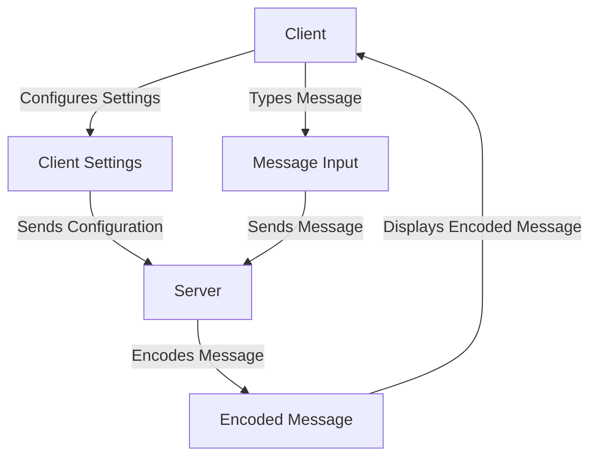

# Learning Django

A simple message encoding app with the API for personal skill development :smile:

Following [freeCodeCamp's tutorial on Django](https://www.youtube.com/watch?v=UmljXZIypDc).

This project is developed on Windows, and utilizes [`miniforge`](https://github.com/conda-forge/miniforge) (`mamba` included) to manage/install Python packages.

Awesome `mermaid` diagram making this look way fancier than it is:



Abbreviations I never really paid attention to before:

- URL: Uniform Resource Locator
- HTTP: Hypertext Transfer Protocol
- HTML: Hypertext Markup Language
- CSS: Cascading Style Sheets

## Mamba Ambush

Open up a project in any folder with VSCode. Mine is located at `D:\dev\personal\learning-django`, and my virtual environments at `D:\dev\.venvs`.

Assuming an installation of `miniforge` properly configured, set up the virtual environment at `D:\dev\.venvs`:

```shell
# Powershell 7.3.9 #
mamba create -p learning-django-venv python=3.11
```

Confirm all prompts, and when it's done, verify it's recognized by mamba. The following commands will print a list of recognized environments, activate it, and print the python version for that environment. If anything fails, the terminal will let you know.

```shell
# Locate in environment list, activate it, and check python version
mamba info -e
mamba activate learning-django-venv
python --version
```

> Depending on whether you use the integrated VSCode terminal or the external terminal, you might/might not need to activate the virtual environment every time you bring it up.
>> To select a python interpreter in VSCode, bring up the command window with `Ctrl + Shift + P`, type in `Python: Select Interpreter`, and select the one associated with the virtual environment.

## Django Unchained

*I am having way too much fun with these section titles.*

Now we have the virtual environment setup, head back to the project folder in that terminal instance, or feel free to close that one and open up a new one in the project folder. Make sure you set the active Python interpreter to that of the created environment within VSCode.

```shell
mamba activate learning django-venv
mamba install django
```

Once this is done, start a django project:

```shell
django-admin startproject msgencoder .
```

This will create a project in the current directory. The `.` at the end is important, as it tells django to create the project in the current directory. If you forget this, you'll end up with a folder named `msgencoder` with another folder named `msgencoder` inside of it, which is not what we want in this case.

A django project involves a minimum of three things (initialized to default values):

1. A directory containing the project's code and settings, in this case, `msgencoder`.
2. A database file, typically a SQLite file, in this case, `db.sqlite3`.
3. A script or command-line utility to handle administrative tasks, in this case, `manage.py`.

To run the  server on the landing page (by default, this works on port 8000):

```shell
python manage.py runserver
```

To run the server on a different port, e.g, 9000, you'd do:

```shell
python manage.py runserver 9000
```

This will run the server in the current terminal instance and can be stopped with `Ctrl + C`. It also prints a link to the landing page, which you can paste in your browser (or follow link from terminal, if supported by your terminal app) to open the landing page.

Note that `msgencoder` contains the following files:

- `__init__.py`: Tells Python that this is a Python package.
- `asgi.py`: Entry point for ASGI-compatible web servers to serve the project.
- `settings.py`: Settings/configuration for this project.
- `urls.py`: URL declarations for this project where new URLs can be added to link with different apps on the server.
- `wsgi.py`: Entry point for WSGI-compatible web servers to serve the project.

> ASGI: Asynchronous Server Gateway Interface, WSGI: Web Server Gateway Interface

Currently, important ones are `settings.py` and `urls.py`, which will define the project's settings and special URLs on top of the landing page URL to access specific functionality and apps of the project.
